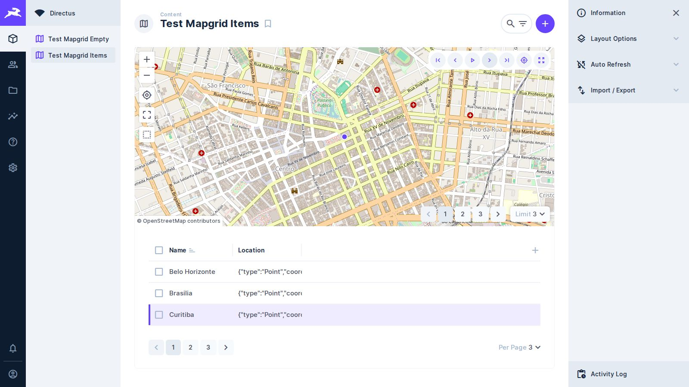
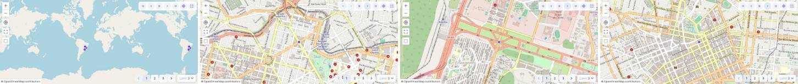

# Task 006 — Navegar e reproduzir os registros no mapa

Status: done
Type: feat
Assignee: sidartaveloso
Difficulty: 3
Priority: 700

## Description

Percorrer os registros da coleção a partir do layout: primeiro, anterior,
próximo, último, e reprodução automática com parada. A grade e o mapa mostram
sempre o mesmo registro — a linha destacada e rolada até a vista, o mapa
enquadrando o item correspondente — e a paginação acompanha: se o registro
pedido está em outra página, a página é trocada antes de ele ser mostrado.

O caso que motiva: uma coleção de posições de rastreamento veicular. Com sort
por data/hora, apertar play faz a câmera percorrer o trajeto na ordem em que ele
aconteceu, em vez de a pessoa clicar ponto a ponto.

A câmera ganha um controle de acompanhamento com três estados, para a pessoa
escolher se o mapa persegue a posição atual e como.

## O que mudou desde que esta task foi escrita

Esta task foi reescrita duas vezes. A primeira versão partia da grade e do mapa
**nossos** (`TableComponent` e `MapComponent`, sobre MapLibre). A segunda já
contava com o `v-table` do Directus na grade, mas ainda com o mapa próprio.

A [task-010](task-010-o-mapgrid-compoe-os-layouts-do-directus.md) trocou os dois
pelos **layouts do Directus**: o MapGrid compõe o layout tabular e o layout de
mapa, e a nossa parte é a composição e a sincronia. Isso muda esta task em três
direções:

- **Parte dos pré-requisitos já veio pronta.** Paginação, `sort` sempre definido
  e um balão sem injeção de HTML existem nos layouts deles.
- **Grade e mapa não recebem mais "o registro atual" por prop.** Não são nossos
  componentes: a única forma de mandar neles é pelo estado que o `setup()` deles
  devolve (`embedLayout`, em `src/services/embedded-layout/`), trocando
  handlers e escrevendo nas chaves que eles leem.
- **O Storybook deixou de alcançar grade e mapa**, porque lá o SDK é um mock nosso
  e o registro de layouts não existe. O comportamento desta task se prova no e2e.
- **A câmera não se move pelo `cameraOptions`.** O componente de mapa do
  Directus só lê a câmera ao montar. Quem move o mapa é o
  `DirectusMapCenterer` (`src/services/map-centerer/`), atrás
  do contrato `IMapCenterer` — o contorno documentado dessa limitação.
  Revisado em 2026-09-24, depois de a task-010 fechar.

Conferido na fonte do Directus 10.13.1 (`app/src/layouts/tabular/` e
`app/src/layouts/map/`), a versão que o e2e roda.

## O contrato entre as camadas

- **layout (`src/index.ts`)** — dono da consulta única (`layoutQuery`), dividida
  pelos dois layouts embutidos. É o único que troca de página, e troca
  escrevendo `page` na consulta (o tabular expõe `toPage`, que faz o mesmo).
- **template (`MapgridLayout.vue`)** — dono do registro atual. Lê itens,
  `page` e `totalPages` do estado da grade embutida e decide qual é o próximo.
- **grade e mapa (layouts do Directus)** — mostram o registro atual porque o
  template escreve no estado deles, não porque recebem prop nossa. Nenhum dos
  dois decide qual é o próximo.
- **câmera** — o template pede ao `IMapCenterer`, nunca ao estado do
  mapa do Directus direto. É o começo do contrato de mapa da
  [task-011](task-011-o-mapgrid-aceita-qualquer-mapa-atras-de-um-contrato-proprio.md),
  e o que esta task acrescentar à câmera entra por ele.

## O que os layouts do Directus já dão, e o que falta

| Assunto | Como está depois da task-010 | Consequência para esta task |
| --- | --- | --- |
| Paginação | O tabular desenha `v-pagination` no rodapé e expõe `page`, `totalPages` e `toPage` | Não há controle de página a inventar: virar a página é chamar o mesmo caminho |
| Ordem | O tabular grava `sort` com um padrão (`defaultSort`: o campo de sort da coleção ou a chave primária) | Sempre há uma ordem. Mas ordem pela chave primária não é ordem temporal — ver pré-requisitos |
| Tamanho da página | O tabular força o `limit` ao tamanho de página do `usePageSize` (padrão 25); o mapa, sozinho, usaria 1000 | Com a consulta compartilhada, conferir se o mapa mostra só a página da grade ou mais. Isso decide se "próximo" pode sair do que está desenhado |
| Balão | O layout de mapa mostra um `itemPopup` no **hover**, com o `displayTemplate` renderizado pelo template do Directus | A injeção de HTML do `setHTML` antigo não existe mais. Não há onde pôr botão dentro do balão |
| Clique na linha | Trocado pelo nosso `onRowClick`, que leva o mapa ao item pelo centralizador | É uma das duas portas de entrada para "registro atual" |
| Clique no ponto | Trocado na task-010: em vez do `router.push` deles, marca o item na `selection` | Não sai mais do MapGrid, mas a `selection` arma as ações em lote. Passa a definir o registro atual |
| Linha em destaque | O `v-table` não tem "linha atual"; o único destaque visível é a `selection`, das caixas de marcação | Destacar sem usar `selection`, porque ela aciona as ações em lote (apagar, editar) |
| Câmera | `cameraOptions` (centro, zoom e `bbox` visível) no estado do mapa, gravado em `layoutOptions.map` a cada `moveend` | Serve para **ler** a área visível. Escrever nele não move o mapa; mover é com o centralizador |

## Pré-requisitos de projeto

Três decisões precisam sair antes do código, porque mudam a implementação.

**A ordem é o que define "próximo".** Sempre existe um `sort`, mas o padrão pode
ser a chave primária, e aí a reprodução percorre a ordem de inserção, não a do
trajeto. Definir: aceitar a ordem que estiver, ou avisar na interface quando o
`sort` não é um campo de data/hora.

**Como destacar a linha atual.** O `v-table` não oferece isso, e usar a
`selection` confunde "estou vendo este" com "marquei este para uma ação em lote".
Candidatos: uma classe aplicada pelo template na linha do DOM (frágil, depende
da estrutura do `v-table`, mas não mexe em estado), ou propor o recurso ao
Directus. Escolher e registrar o motivo.

**O controle de câmera absorve parte do `zoomOnClick`.** A opção booleana, que
continua nossa, mistura duas coisas: se a câmera se move e se ela também
aproxima. Hoje o `centerItem` sempre move (`onlyIfOutside: false`) e, com
`zoomOnClick`, aproxima (`zoomIn: true`, até o `maxZoom` 14 do Directus). Com
o controle de três estados, `zoomOnClick` deve deixar de decidir
movimento e passar a significar apenas "aproximar ao focar", que é uma escolha
ortogonal.

### Decisões tomadas (2026-09-25)

**A ordem é a da consulta, e a interface não avisa nada.** Aceitar o `sort` que
estiver. Um aviso de "este sort não é temporal" erraria nos casos legítimos que
não são data/hora — um campo `sort` manual, um número de sequência do trajeto,
uma ordem por quilometragem —, e a ordem já está visível na própria grade, que é
onde a pessoa a troca. O `RecordSequence` não sabe o que é o `sort`: ele percorre
a lista na ordem em que a consulta a devolveu, e é só isso que "próximo"
significa.

**A linha atual é marcada por classe no DOM, não pela `selection`.** O
`TableRowHighlighter` põe `.mapgrid-current-row` no `tbody tr` do índice atual e
rola com `scrollIntoView({ block: 'nearest' })`. Custou uma suposição — a de que
a tabela deles desenha as linhas como `tbody tr`, a mesma que os e2e já fazem em
`ROWS` — e em troca não toca em estado nenhum do Directus: nada mais no layout
reage à marca, e as ações em lote continuam falando só da `selection`. Propor o
recurso ao Directus continua valendo, mas não bloqueia esta task.

**O clique na linha passou a obedecer ao acompanhamento da câmera.** As duas
portas de entrada definem o mesmo estado, e não dois caminhos — então o clique
direto entra pelo mesmo `framing()` que o passo automático. Antes ele sempre
movia (`onlyIfOutside: false`); com o padrão `follow`, ele move quando o item
está fora da área visível. Custo medido no e2e: três specs de `mapgrid-routes`
e um de `mapgrid-layout` começavam clicando numa linha para levar a câmera a um
lugar conhecido, e com o mapa aberto enquadrando a coleção inteira esse clique
deixou de mover — eles passavam por corrida, clicando antes do primeiro
`moveend`. Os quatro agora declaram `cameraTracking: 'center'` no preset, que é
a precondição contra a qual foram escritos.

**`zoomOnClick` passa a significar só "aproximar ao focar".** Quem decide se a
câmera se move é o `cameraTracking`; o `zoomOnClick` entra no
`CameraTrackingPolicy.framing()` como o `zoomIn`, ortogonal ao `onlyIfOutside`.
Em `off` o `framing()` devolve `null` e a câmera não se mexe, com `zoomOnClick`
ligado ou não.

## Os seis controles

| Controle | O que faz | Na borda |
| --- | --- | --- |
| Primeiro | Vai ao primeiro registro da consulta | Página 1, primeiro item |
| Anterior | Recua um registro | No primeiro da página: volta uma página e vai ao **último** item dela. No primeiro da consulta: não faz nada |
| Próximo | Avança um registro | No último da página: avança uma página e vai ao **primeiro** item dela. No último da consulta: não faz nada |
| Último | Vai ao último registro da consulta | Última página, último item |
| Play | Avança sozinho, num intervalo configurável | Vira a página como o "próximo" faz |
| Stop | Para onde está, mantendo o registro atual | — |

Regras que valem para os seis:

- Enquanto a página nova está carregando, a navegação espera. Não pula registros
  nem dispara um passo em cima de uma lista que ainda é a antiga. O estado da
  grade tem `loading` para isso.
- Trocar de página nunca reenquadra a coleção inteira: quem manda na câmera é o
  estado de acompanhamento, não o refetch. O mapa deles só reenquadra sozinho
  quando não há `cameraOptions` gravado ou quando alguém pede `fitDataBounds` —
  conferir que a troca de página não cai em nenhum dos dois.
- Filtro, busca, sort ou limite mudaram: a sequência é outra. Definir o que
  acontece com o registro atual — provavelmente parar a reprodução e recomeçar do
  primeiro.

## Controle de câmera: nomes propostos

O pedido chamou de "autofoco". Proponho não usar esse nome: em fotografia
autofoco é nitidez de lente, e o que se descreve aqui é enquadramento.
Aplicativos de navegação chamam isso de *follow mode*. Sugestão, aberta a
discussão:

**Controle:** `cameraTracking` — "Acompanhamento da câmera" / "Camera tracking".

| Estado | pt-BR | en-US | Comportamento | Ícone |
| --- | --- | --- | --- | --- |
| `off` | Livre | Free | O mapa fica onde a pessoa deixou | `gps_off` |
| `follow` | Seguir | Follow | Move só quando o item sai da área visível | `gps_not_fixed` |
| `center` | Centralizar | Keep centred | Mantém o item sempre no centro | `gps_fixed` |

Os três ícones são o idioma consagrado dos aplicativos de navegação e já vêm no
Material Symbols que o projeto carrega, então o controle único pode ser um botão
que cicla entre os três estados, na `MapToolbar`.

## Tasks

### Fase 1: a sequência
- [x] Módulo puro em `src/services/` que, dada a lista da página, o id atual e a
      posição da página no total, responde o que é primeiro, anterior, próximo e
      último — e quando a resposta exige trocar de página, diz qual página e se o
      alvo é o primeiro ou o último item dela. Feito:
      `src/services/record-sequence/`, `RecordSequence implements IRecordSequence`
- [x] Decidir e documentar o que fazer quando o `sort` não é temporal. Decidido:
      aceitar a ordem que estiver, sem aviso — ver "Decisões tomadas"
- [x] Testes cobrindo: primeiro e último da página, primeiro e último da consulta
      inteira, item ausente da lista, lista vazia, e uma página só

### Fase 2: o registro atual sobe para o template
- [x] Um lugar só para "qual é o registro atual", no template: o `currentId` e o
      `focus()` em `MapgridLayout.vue`
- [x] Clicar no ponto define o registro atual. Deixou de escrever na `selection`
- [x] Clicar na linha e clicar no ponto passam a ser duas formas de definir o
      mesmo estado, e não dois caminhos separados: os dois chamam `focus()`
- [x] A grade destaca e rola até a linha do registro atual, sem usar `selection`:
      `TableRowHighlighter`, classe `.mapgrid-current-row`
- [x] O mapa enquadra o registro atual pelo `IMapCenterer`,
      respeitando o acompanhamento de câmera da Fase 6

### Fase 3: navegação manual
- [x] Os quatro controles de passo na `MapToolbar`, com a borda de cada um
      conforme a tabela
- [x] Desabilitar primeiro/anterior na primeira posição e próximo/último na
      última, em vez de deixá-los clicáveis sem efeito. Também desabilitados
      enquanto a página carrega
- [ ] **Não feito.** Atalhos de teclado, ativos só quando o layout tem foco,
      conferindo que não colidem com os atalhos do próprio Directus. Ficou de
      fora porque "não colide com os atalhos do Directus" só se confere contra a
      lista deles, e essa verificação não cabia na rodada junto do resto — adiado: movido para a task-015

### Fase 4: reprodução automática
- [x] Play e stop, e intervalo entre passos configurável nas opções do layout,
      na nossa seção `.mapgrid-option--playback`. Play e stop são um botão só,
      que mostra o que dá para fazer agora
- [x] A câmera acompanha o item em reprodução sem reenquadrar a coleção inteira:
      cada passo chama `centerItem`, e `fitAll` só sai do botão de reenquadrar
- [x] Parar sozinho no último registro da última página
- [ ] **Não feito.** Avaliar o agrupamento durante a reprodução: um ponto dentro
      de um cluster não aparece sozinho, e a reprodução ficaria invisível. O
      `clusterData` é opção do mapa deles, gravada no preset — desligá-lo só
      durante a reprodução não pode gravar a mudança — adiado: movido para a task-015

### Fase 5: virar a página
- [x] Virar a página pelo mesmo caminho do rodapé do tabular: o `goToPage` do
      `src/index.ts` escreve `page` na consulta compartilhada. Nenhum controle
      de paginação novo
- [x] Próximo no fim da página avança e cai no primeiro item da próxima;
      anterior no começo recua e cai no **último** item da anterior
- [x] Cobrir a espera pela busca: a navegação pausa enquanto a página carrega, em
      vez de pular registros
- [ ] **Não feito.** Medir com uma coleção de rastreamento de verdade. Com 25 por
      página, um trajeto de mil pontos são quarenta requisições durante a
      reprodução — e, com a consulta compartilhada, possivelmente o dobro.
      Avaliar um tamanho de página maior durante a reprodução, ou buscar a
      próxima página antes de precisar dela. O seed do e2e tem oito registros,
      que provam o comportamento mas não medem nada — adiado: movido para a task-015

### Fase 6: acompanhamento da câmera
- [x] Traduzir o estado para o centralizador: feito no `CameraTrackingPolicy`,
      que devolve `null` em `off` e as `CenteringOptions` nos outros dois
- [x] Para item que não é ponto, "onde está o item" é o bbox da geometria, e não o
      primeiro vértice. Já feito: o centralizador enquadra linha, polígono e
      `Multi*` pelo bbox (task-010)
- [x] Controle único ciclando entre os três estados, com ícone e rótulo por estado
- [x] Persistir o estado nas opções do layout, com `follow` como padrão
- [x] Reduzir `zoomOnClick` a "aproximar ao focar", sem decidir movimento
- [x] Textos em en-US e pt-BR

### Fase 6b: onde ficam os controles

Veio da task-008, que propunha levar controles do painel lateral para o mapa.
Depois da task-010 o painel lateral é outro: tem as seções dos dois layouts do
Directus e uma nossa, só com o `zoomOnClick`. O aperto que motivava esta fase —
títulos quebrando em `Popup Pin Map` e `Table Columns` — não existe mais, e o
centro do mapa deixou de ser opção digitada: o mapa deles grava a câmera sozinho.

- [x] Decidir onde mora cada grupo: passo e reprodução, acompanhamento de câmera.
      Decidido na task-010 ("A `MapToolbar` é do MapGrid"): os dois moram na
      `MapToolbar`, que é do MapGrid e fala com o contrato do mapa. A paginação
      segue no rodapé da grade
- [x] A `MapToolbar` fica sobre o componente deles, por posicionamento absoluto.
      O `ButtonControl` do Directus exigiria a instância do MapLibre, que não é
      exposta — e prenderia os controles a um mapa só, contra a direção da
      task-011

### Fase 7: verificação

O Storybook não alcança os layouts do Directus, então o `play` fica para o que é
nosso: a `MapToolbar` com os controles novos e os módulos puros. Grade, mapa e a
sincronia entre eles se provam no e2e.

Os ganchos `data-center` e `data-zoom` e o `getCameraState()` eram do
`MapComponent` e saíram com ele. A câmera se lê agora pelo `cameraOptions` do
estado do mapa, ou pelo que ele grava em `layoutOptions.map` do preset.

- [x] Unitários dos módulos puros (sequência e acompanhamento de câmera), e
      também do `TableRowHighlighter` e da `MapToolbar`
- [x] Stories com `play` da `MapToolbar`: cada controle emite o que deve, e os de
      borda aparecem desabilitados
- [x] `pnpm check:stories` limpo, rodado na revisão fora do sandbox. O gate foi
      provado: com uma asserção do `play` da `MapToolbar` quebrada de propósito,
      ele sai 1 e mostra o `AssertionError`
- [x] e2e de navegação: próximo avança um registro, a linha destacada acompanha e
      a câmera vai ao item; anterior desfaz o passo
- [x] e2e de primeiro e último, caindo nas pontas da consulta e não da página
- [x] e2e de clique no ponto: define o registro atual e **não** sai do MapGrid
- [x] e2e de reprodução: dar play, aguardar alguns passos, dar stop, e conferir
      que parou onde deveria
- [x] e2e de virada de página nos dois sentidos. A página é sedada em três
      registros contra as oito cidades do seed — a consulta fica com três
      páginas, sem coleção nova
- [x] e2e por estado da câmera: em `off` o `cameraOptions` não muda; em `center`
      muda a cada passo. O caso `follow` ficou nos unitários do template: no e2e
      ele depende de onde a câmera parou depois do primeiro `moveend`, e um
      teste que às vezes afirma "moveu" e às vezes "não moveu" não afirma nada
- [x] Refazer a captura do README com os controles novos visíveis
- [x] Descrever os controles novos nas duas versões do README, que são dois
      documentos completos e não um com trechos traduzidos

### Evidência

Capturada em 2026-09-25, com `EVIDENCE_TASK=006 EVIDENCE_MOMENT=depois
.sandcastle/on-mirror.sh pnpm screenshot`.

A barra do MapGrid no alto à direita do mapa, com os sete controles; a linha de
Curitiba com a marca de registro atual — o fundo e a barra da borda inicial, que
não são os da caixa de seleção, que segue desmarcada; e o mapa enquadrado nela.
O rodapé mostra as três páginas de três registros que o e2e usa.

Um quadro do painel do mapa por passo, com `cameraTracking: center`: a câmera
anda a cada "próximo". Voo de câmera não cabe num quadro só, e os quadros foram
conferidos como diferentes entre si dentro do próprio teste.

A captura do README (`docs/tela.jpg`) foi refeita na mesma execução: mostra a
barra nova e o painel lateral com as quatro seções, incluindo *Zoom on focus* e
*Playback*.

A evidência de clique no ponto saiu da mesma execução com 319 KB e não entrou:
o `scripts/tamanho-de-evidencia` reprova qualquer arquivo de `TASKS/assets`
acima de 300 KB. O que ela mostrava — o ponto clicado virando registro atual —
está na captura da composição e no e2e `clicking a marker sets it, and does not
leave the MapGrid`. Fica o aviso para quem reexecutar: o
`evidence-marker-click` grava PNG, e o PNG desta tela nasce perto do teto (o da
task-010 ficou em 276 KB).

## Notes

A task-010 está integrada (`develop` em `c513b29`), e o enquadramento por bbox
que a Fase 6 esperava da task-007 veio com o centralizador. Nada mais bloqueia
esta task.

Todos os e2e dividem o mesmo preset do admin, e por isso a suíte roda com um
worker só (`playwright.config.ts`). Um e2e desta task que grave `page`, `sort`
ou câmera não pode supor que outro teste não mexeu no preset antes dele: cada um
parte do `ensureMapGridPreset`.

Um passo por registro tem limite prático: em reprodução rápida, cada passo pede
uma animação de câmera ao mapa deles. Ou o intervalo respeita a animação, ou a
reprodução pede a câmera sem animação.
