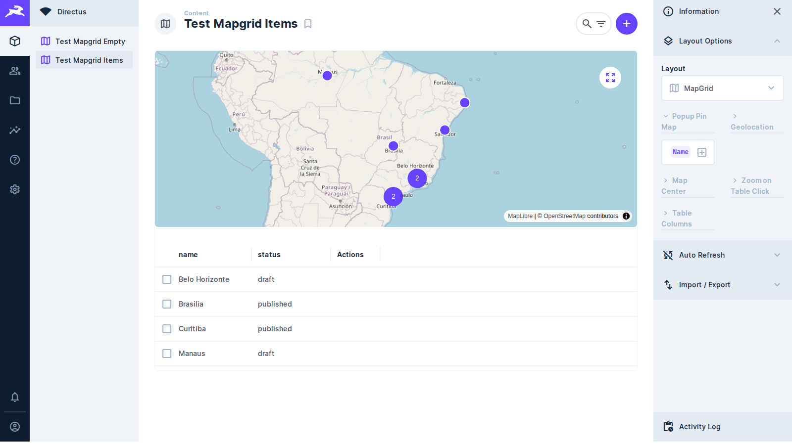
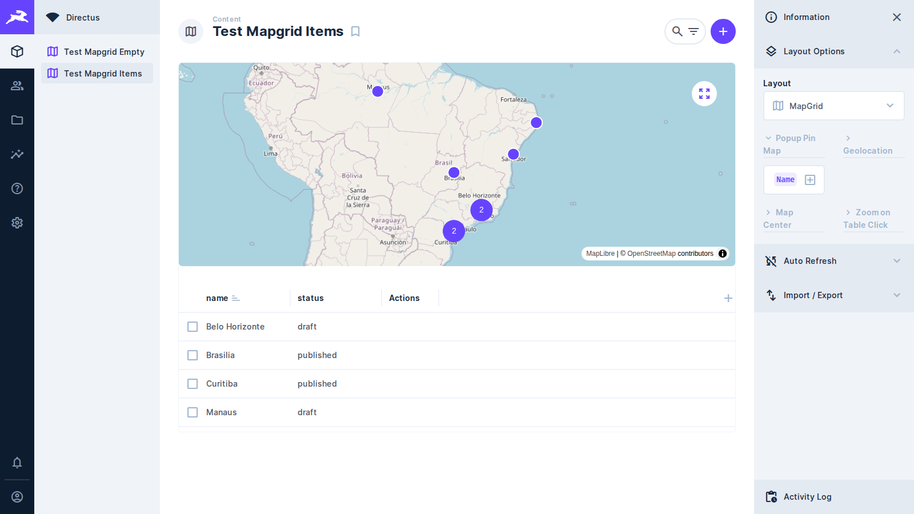
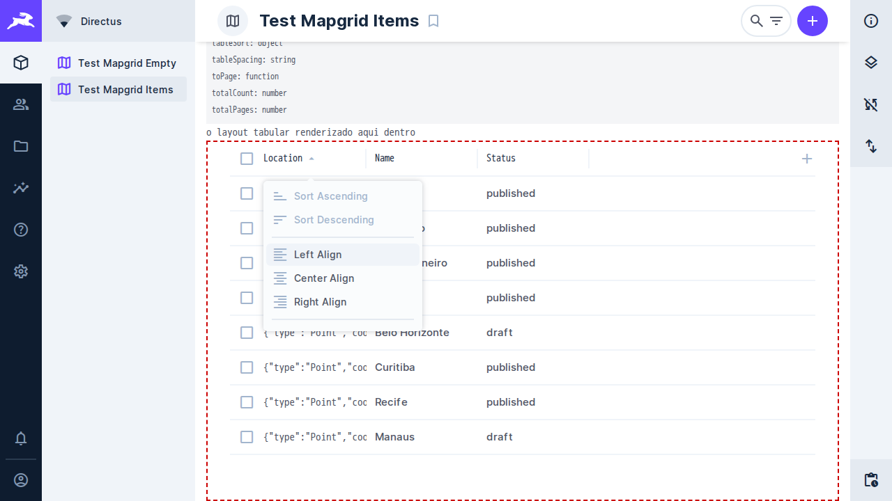
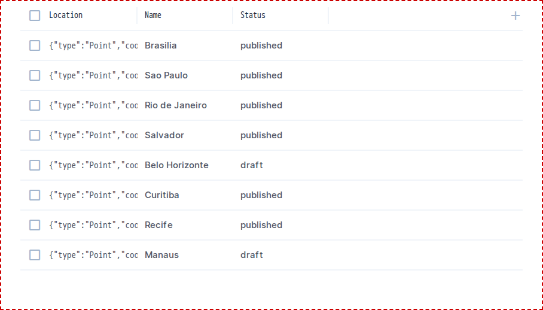
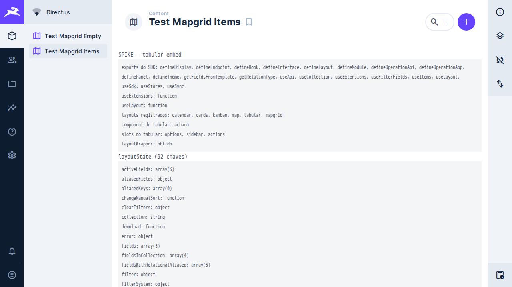

# Task 008 — A grade se comporta como a do Directus

Status: done
Type: refactor
Assignee: sidartaveloso

## Description

Quem já usa o layout tabular do Directus espera duas coisas da grade que a nossa
não entrega: ordenar clicando no cabeçalho, e escolher as colunas ali mesmo, em
vez de num painel lateral. Fazer igual ao que já existe evita que aprender um
layout não sirva para o outro.

Uma das duas frentes é correção de defeito, não melhoria.

## 1. Ordenação pelo cabeçalho — está quebrada, não ausente

`resolvedHeaders` marca **toda** coluna de dados com `sortable: true`, então o
`v-table` desenha o cabeçalho como clicável. Mas nada liga o clique:

- o `v-table` nunca recebe a prop `sort`;
- não existe `@update:sort` em lugar nenhum de `src/`;
- `layoutQuery.sort` era somente leitura no `setup` — a task-005 torna gravável.

Ou seja, a grade **promete ordenação e não entrega**. O usuário clica no
cabeçalho e não acontece nada, que é pior do que não oferecer: ele culpa o
próprio clique.

O caminho de volta já existe em parte, porque o `useItems` já recebe esse `sort`.
Falta ligar o evento.

## 2. Seleção de colunas no cabeçalho

A task-005 trocou os cinco selects numerados por um seletor de campos, mas o
deixou no painel lateral. O layout tabular do Directus põe isso **no cabeçalho da
tabela**: um `+` abre o `VFieldList`, e o menu de contexto de cada coluna oferece
remover.

Verificado na fonte do Directus que as peças existem e são alcançáveis por
extensão: `VFieldList` está entre os componentes registrados globalmente, e o
`v-table` aceita `v-model:headers` e `allow-header-reorder` — o que também abre
caminho para reordenar coluna arrastando, hoje impossível.

## Tasks

### Fase 1: consertar a ordenação
- [x] Ligar `@update:sort` do `v-table` a `layoutQuery.sort`
- [x] Passar o `sort` atual de volta ao `v-table`, para o cabeçalho mostrar a
      direção em que está ordenado
- [x] Decidir o que fazer com a coluna de ações, que não é ordenável: continua
      com `sortable: false`, coberto por teste
- [x] Conferir a interação com o mapa: reordenar troca a página de itens, e o
      enquadramento só roda uma vez (`performInitialFitBoundsOnce`) — coberto
      por teste, que acusa duas chamadas se o guarda sair

### Fase 1b: ordenar deixou de ser um clique no cabeçalho
- [x] O `v-table` do Directus **troca** o clique que ordena por abrir o menu
      assim que o slot `header-context-menu` existe — é por isso que o layout
      tabular põe "ordem crescente" e "decrescente" dentro do menu. Ao levar a
      escolha de colunas para o cabeçalho, herdamos esse comportamento, e
      ordenar passou a morar no mesmo menu
- [x] Corrigir o formato: passávamos `string[]` ao `v-table`, que fala
      `{ by, desc }`, e devolvíamos o objeto cru para `layoutQuery.sort`. A
      tradução virou um módulo puro em `src/contract/table-sort.ts`

### Fase 2: colunas no cabeçalho
- [x] Mover o seletor de campos do painel para o cabeçalho da grade
- [x] Remover coluna pelo cabeçalho, não por chip no painel
- [x] Avaliar `v-model:headers` e `allow-header-reorder` para reordenar
      arrastando — feito: a grade aceita `allow-header-reorder`, e a ordem nova
      volta como a ordem dos campos escolhidos, que é onde o preset já a guarda
- [ ] `widthMap` para largura por coluna fica de fora por ora: a largura não tem
      onde morar sem uma chave nova em `layoutOptions`, e escrita de
      `layoutOptions` não chega ao preset — é o defeito da task-009
- [x] Manter o contrato: quem grava continua sendo `layoutQuery.fields`, com a
      migração dos presets antigos que a task-005 já implementou

### Fase 3: verificação
- [x] Unitários do que for lógica pura
- [x] Stories com `play` para ordenação e escolha de coluna — como nasceram,
      passavam sem abrir menu nenhum; ver o achado de 2026-09-18
- [x] e2e: ordenar por uma coluna e conferir que a escolha sobrevive a reload
- [x] e2e: escolher um campo pelo cabeçalho e conferir que sobrevive a reload
- [x] `pnpm screenshot` — as duas frentes mudam a tela, e refazer a captura do
      README é item da task, não acerto posterior

## Evidência visual

| Antes | Depois |
| --- | --- |
|  |  |

O que mudou entre as duas capturas:

**No painel lateral.** O "antes" tem cinco seções, e a última é **Table Columns**
— é lá que os campos exibidos eram escolhidos, por chips e um botão "Add field".
No "depois" essa seção não existe mais: sobraram quatro, todas de configuração da
coleção, e elas passam a caber lado a lado sem quebrar o título em duas linhas —
a evidência de aperto que motivou a Fase 4b da task-006.

**No cabeçalho da grade.** No "antes" o cabeçalho traz apenas `name`, `status` e
`Actions`. No "depois" aparecem duas coisas: o **+** no fim da linha, que abre a
lista de campos da coleção, e o ícone de ordenação ao lado de `name`, mostrando
por qual coluna a grade está ordenada. Cada cabeçalho passou também a abrir um
menu de contexto com ordem crescente, ordem decrescente e ocultar campo.

### Como o par foi gerado

Pela convenção do `geohub/scripts/captura-de-tela`: as duas imagens ficam em
`TASKS/assets/`, com o momento no **nome** e não em subpasta, para que o par
apareça lado a lado ao abrir a pasta. A nomeação veio para cá em
`scripts/captura-de-tela/`, com seus testes.

O "antes" não é a imagem antiga renomeada: é uma captura nova, feita rodando o
mesmo roteiro autenticado contra o `dist/index.js` reconstruído da revisão
anterior a esta task (`2846b76`), no mesmo Directus, mesma coleção e mesmo
viewport de 1600x900. A única diferença entre as duas imagens é a extensão — que
é exatamente o que uma evidência precisa isolar. Capturar o "antes" depois de
fazer a mudança seria tarde demais: só o git ainda tem aquele estado.

    EVIDENCE_TASK=008 EVIDENCE_LABEL=grade EVIDENCE_MOMENT=antes|depois \
      RUNNER_CMD=screenshot docker compose -f docker-compose.test.yml \
      --profile runner up --abort-on-container-exit --exit-code-from tests

## Achado de 2026-09-18 — as stories passavam por um defeito do stub

O `header-context-menu` não era popup no stub do `v-table`: saía renderizado uma
vez por coluna, sempre montado, num bloco acima da grade. No Storybook isso
empilhava "ordem crescente / decrescente / ocultar campo" de todas as colunas, e
o `+` ficava permanentemente na cor de aberto, porque o stub do `v-menu` tinha
`toggle` vazio e `active` fixo em `true`. Os dois nasceram nesta task.

O `play` das duas stories passava **por causa disso**: clicava direto no item do
menu, sem abrir menu nenhum — um estado que no app real não existe. O
`check:stories` não pega, porque só procura escrita no console.

Os stubs agora têm o estado de abrir e fechar, como o `v-table` de verdade: o
clique no cabeçalho abre o menu daquela coluna e fecha o das outras, e o `+`
passou para um `th` no fim da linha, que é onde ele mora no Directus e é como o
e2e já o encontrava. Os `play` e os unitários abrem o menu antes de clicar, e
dois unitários novos fixam que menu e seletor começam fechados.

A lição que fica é sobre o stub, não sobre a grade: um stub que monta tudo de uma
vez deixa o teste alcançar o que o usuário não alcança.

## Spike de 2026-09-18 — usar o layout tabular em vez de imitá-lo

A pergunta que sobrou desta task: em vez de manter o nosso `v-table` mais o
conteúdo dos slots, dá para **embutir o layout tabular do Directus** aqui dentro?
O que nos falta — alinhamento por coluna, largura, o menu completo — é justamente
o que ele já tem pronto.

Antes de tudo, uma correção de premissa: a grade já **é** a do Directus. O
`v-table` é o componente real, e o seletor de campos do `+`, com busca e submenus
de relação, é o `v-field-list` real. O que escrevemos é só o conteúdo do slot
`header-context-menu`, e esse conteúdo é autoral por layout — é de lá que vêm os
"Alinhar à esquerda/centro/direita" do tabular.

Medido no app real, em `spike/tabular-embed` (`0ce82c9`, `fedb3f5`). **Não dá
para medir no Storybook**: lá o `@directus/extensions-sdk` é um mock nosso, que
nem exporta `useLayout`, e o layout tabular não existe fora do app do Directus.

### O que o spike achou

- O SDK que o **Directus 10.13.1** entrega em runtime exporta `useLayout` e
  `useExtensions`. Isso era risco real: o bundle resolve o SDK como externo, e
  compilamos contra o SDK 16. Layouts registrados: `calendar, cards, kanban,
  map, tabular, mapgrid`; os slots do tabular são `options, sidebar, actions`.
- O wrapper de `useLayout` **não desenha nada**: ele chama o `setup()` do layout
  e entrega tudo num slot `default` como `{ layoutState }`. Quem renderiza o
  component é quem chama.
- O tabular renderizou dentro do nosso layout, com tabela, seleção e o `+`.
- `layoutState` tem 92 chaves, e duas derrubam objeções que eu tinha levantado:
  `items` (os itens que ele mesmo buscou, então o mapa se alimenta dali, sem
  segundo fetch) e `onRowClick` (dá para trocar pela nossa função).
- Sobem como emit **só** `selection`, `layoutOptions` e `layoutQuery`. Como
  alinhamento e largura moram em `layoutOptions`, embutir entrega as features mas
  **não** resolve persistir: isso continua sendo a task-009.
- Sem trocar o `onRowClick`, o clique na linha navega para o item
  (`/admin/content/<colecao>/1`) em vez de destacar o marcador — medido.
- A coluna de geometria sai como JSON cru: o tabular usa os displays do Directus,
  e o tratamento que o nosso `ValueCell` dá a campos sem display se perderia.

### O que ele desenhou

Capturas do spike rodando, não do produto — o `dist` aqui é o do branch, em que o
`component:` aponta para o spike. Em todas, o tracejado vermelho é a borda do
spike: o que está dentro dela é o layout tabular do Directus.

| O menu de contexto dele | A grade embutida |
| --- | --- |
|  |  |

No menu aparecem "Sort Ascending/Descending" e "Left/Center/Right Align" — as
duas de ordenação esmaecidas porque a coluna clicada foi `Location`, que é
geometria e não ordena. Na grade se vê o outro lado da moeda: `Location` sai como
JSON cru, sem o tratamento que o nosso `ValueCell` dá.

A tela inteira mostra o relatório que o spike despeja antes da grade: os exports
do SDK em runtime, os layouts registrados e as 92 chaves do `layoutState`.

### Veredito

Viável, e melhor do que parecia — mas **depois da task-009**, não antes: o ganho
principal é exatamente o que ela desbloqueia. Fica sem medir quanto do visual do
tabular assume a tela inteira, já que aqui ele divide espaço com o mapa.

### Como rodar o spike

Nesta máquina o host não alcança portas publicadas pelo docker, então
`pnpm test:e2e` (que roda o Playwright no host) expira no setup. O caminho que
funciona é de dentro da rede:

    docker compose -f docker-compose.test.yml --profile runner run --rm tests \
      bash -lc 'npm i -g pnpm@10.15.0 && pnpm install --frozen-lockfile && \
      pnpm exec playwright test --config=playwright.config.ts \
      tests/e2e/SPIKE-tabular.spec.ts --reporter=list'

## Notes

Depende da task-005 em dois pontos: ela torna `sort` gravável, sem o que a Fase 1
não tem onde escrever, e ela já resolveu a migração dos presets antigos, que a
Fase 2 precisa preservar.

Os controles que ficam **sobre o mapa** saíram desta task e foram para a 006, que
já desenha a barra do mapa com o controle de câmera e os botões de reprodução.
Decidir a barra em duas tasks sairia torto.

A ordenação quebrada é independente da Fase 2 e pode ir sozinha, se houver pressa
— é defeito visível para quem usa hoje.

Mover a escolha de colunas para o cabeçalho contorna o sintoma da task-009 para
esse caso: a escrita passa a sair do componente do layout, em `layoutQuery`, e
não do painel de opções, cujas escritas não chegam ao preset. É o mesmo caminho
pelo qual a ordenação já persistia. O defeito continua de pé para as demais
opções — o centro do mapa, o zoom, o template do balão — e continua sendo da
task-009 resolver.
