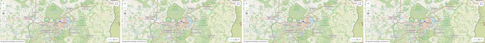
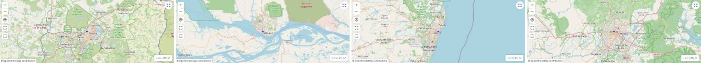
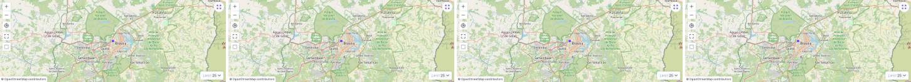

# Task 010 — O MapGrid compõe os layouts do Directus

Status: in-progress
Type: refactor
Assignee: sidartaveloso
Priority: 10

## Description

Hoje a extensão **reimplementa** o que o Directus já tem: a nossa grade imita o
layout tabular, e o nosso mapa imita o layout de mapa. A proposta é inverter —
compor os dois layouts que o Directus já registra, e a extensão passa a ser a
composição e a sincronia entre eles, não a reimplementação de nenhum.

O spike de 2026-09-18/19 mediu isso ponta a ponta no Directus 10.13.1, no branch
`spike/tabular-embed`. O registro completo está na task-008; o essencial:

- `layout.setup(props, { emit })` roda de dentro do **nosso** `setup()`, fora do
  `createLayoutWrapper`. Como o Directus entrega o retorno do nosso `setup()`
  tanto ao componente quanto ao painel de opções, o estado nasce num lugar só e
  chega aos dois — é o que resolve o painel, que é irmão do layout na árvore.
- Os dois layouts montam: `tabular: ok, 68 chaves · map: ok, 76 chaves`.
- As duas configurações deles aparecem na nossa barra lateral, ligadas ao mesmo
  estado que desenha, e abrir os painéis custa **zero** consulta a mais.
- `selection` e `layoutQuery` compartilhados sincronizam os dois: marcar na
  grade aparece no estado comum, e ordenar pelo cabeçalho deles refaz a busca
  dos dois.
- O clique na linha volta a ser nosso trocando o `onRowClick`.

## O que se ganha

O menu de cabeçalho inteiro (ordenar, alinhar, ocultar campo), largura de
coluna, o seletor de campos com busca e submenus de relação, os displays do
Directus nas células, e a configuração do mapa deles: mapa base, campo
geoespacial, template de exibição e agrupamento.

## O que se perde, e o que fica (decidido em 2026-09-19)

Adotar o layout de mapa deles aposenta o nosso `MapComponent` e o `MapToolbar`.
Duas coisas ficam, por decisão:

- **O clique linha→mapa fica.** É a razão de existir da extensão, e o spike já
  provou que dá, trocando o `onRowClick`.
- **Reenquadrar e zoom ao clicar ficam.** Significa reconstruir o `MapToolbar`
  sobre o mapa deles — injetar controle nosso dentro do componente deles, que é
  a parte mais cara desta task e não foi medida pelo spike.

Vão embora: o template do popup como é hoje, o enquadramento inicial único
(`performInitialFitBoundsOnce`) e os rótulos de agrupamento próprios.

Isso encosta em duas tasks abertas:

- **task-006** (navegar e reproduzir os registros no mapa) teria de ser
  reconstruída sobre o mapa deles, ou abandonada.
- **task-007** (honrar a configuração de mapa do Directus) talvez seja
  *atendida* por esta, já que o layout deles lê a configuração nativa.

## Pré-requisito — destravado em 2026-09-19

A decisão do dia foi fazer a task-009 primeiro, porque alinhamento, largura,
mapa base, campo geoespacial e agrupamento moram todos em `layoutOptions`, e o
diagnóstico dela dizia que `layoutOptions` não chegava ao preset.

A medição foi refeita e **não há defeito**: o painel grava e sobrevive ao
reload. A 009 fechou como erro de medição, e o bloqueio não existe. O teste de
regressão está em `tests/e2e/mapgrid-options-persistence.spec.ts`.

## Tasks

### Fase 1: fundação — fechada em 2026-09-24
- [x] Extrair do spike o `embedLayout(id, options)`: chama o `setup()` do layout
      registrado, acrescenta os `onUpdate:<chave>`, devolve estado, componente e
      `slots.options`. Sem `any` — o spike usa, a implementação não pode.
      É o `embutirLayout` de `src/services/embedded-layout/`, e não há `any` nele
- [x] Repassar `...toRefs(props)` junto do estado, como o `createLayoutWrapper`
      faz: o spike devolveu 68 chaves contra as 92 do wrapper, e a diferença são
      os props
- [x] Teste de contrato: falha alta se `tableHeaders`, `onSortChange`, `items`,
      `geometryField` ou `slots.options` sumirem do que o Directus devolve.
      Ver "O contrato deixa de ser um comentário", abaixo — o que existia no
      lugar não tinha como falhar por causa do Directus

### Fase 2: a composição
- [x] `selection` e `layoutQuery` como estado único, os dois layouts escrevendo
- [x] `onRowClick` nosso, para o clique na linha enquadrar em vez de navegar.
      O clique deixou de navegar e o mapa enquadra pelo
      `CentralizadorDoMapaDirectus`, contorno documentado de uma limitação do
      componente do Directus — ver "O enquadramento pelo clique na linha",
      abaixo. Fechado em 2026-09-23
- [x] O caminho inverso: o `handleClick` do layout de mapa faz `router.push` para
      a tela do item quando não está em modo de seleção, então **clicar num ponto
      hoje sai do MapGrid**. Antes da composição, clicar no marcador selecionava a
      linha na grade, e o e2e que cobria isso ("should select the matching grid
      row when clicking a map marker") saiu na reescrita do `mapgrid-layout.spec.ts`.
      Trocar o `handleClick` como o `onRowClick` foi trocado, e devolver o e2e.
      A task-006 parte daqui para "clicar no ponto define o registro atual".
      Fechado em 2026-09-23 — ver "O clique no ponto" abaixo
- [x] Reverter as suposições de página inteira, que não estão na API e só o DOM
      revela: `.layout-tabular` traz `margin: 32px 0 132px`; o cabeçalho é
      `sticky` com deslocamento da altura do cabeçalho do app; `.layout-map`
      nasce `flex: 0 1 auto` e não estica
- [x] Decidir o destino do `MapToolbar`, do zoom ao clicar e do popup —
      decidido por Sidarta em 2026-09-24, ver "A `MapToolbar` é do MapGrid",
      abaixo

### Fase 3: o que sai
- [ ] `TableComponent`, `MapComponent`, `MapToolbar` e os stubs que os servem —
      os dois primeiros já não têm arquivo, mas `src/components/index.ts` ainda
      os **exportava** de `./organisms/...`, um caminho que não existe. Nenhum
      gate pegou: o barril não tem importador, então nem o `vue-tsc` nem o build
      chegam nele. As duas linhas saíram em 2026-09-24. O `MapToolbar` **fica**
      (decisão abaixo)
- [ ] O "reenquadrar" da `MapToolbar` passa pelo `CentralizadorDoMapaDirectus`
      (`enquadrarTudo`), em vez de chamar o `fitDataBounds` do layout do
      Directus direto (`doMapa('fitDataBounds')`)
- [ ] `table-sort.ts`, `fieldsToFetch` e o que mais deixar de ter chamador.
      Inventário conferido em 2026-09-24, sem chamador de produção: `table-sort`
      (só o próprio teste e o barril `src/contract/index.ts`), `fieldsToFetch`
      (só o próprio teste) e o `ValueCell` inteiro — componente, story, mock e
      teste — que era da célula do `TableComponent`. Apagar o `ValueCell` mexe
      no padrão storytype da task-003, e por isso ficou fora desta rodada
- [ ] A migração de preset da task-005 **fica**: `layoutQuery.fields` continua
      sendo o contrato
- [ ] Decidir o destino da migração do formato numerado (`coluna1..5`). Ela saiu
      na prática: o `normalizeLayoutOptions` segue em `src/contract/`, mas nada
      em `src/index.ts` o chama, e a grade embutida lê `fields` direto da
      consulta. Um preset da versão antiga não perde dados, mas as colunas dele
      deixam de ser honradas. Ou a migração volta, ou ela é abandonada de
      propósito — e aí saem juntos o `normalizeLayoutOptions` e o e2e que a
      cobria, hoje parado em `test.fixme` no `mapgrid-columns.spec.ts`

### Fase 4: verificação
- [ ] Os 155 unitários de hoje se apoiam nos componentes que saem; refazer o que
      continuar valendo e apagar o que virar teste de código morto
- [ ] Stories: o Storybook não alcança os layouts do Directus, porque lá o SDK é
      um mock nosso. Decidir o que resta de story
- [ ] e2e é onde esta task se prova, e o ambiente do docker é o único lugar
- [x] Reancorar os specs que ainda miram os componentes que saíram. Os seletores
      passaram a morar em `tests/e2e/helpers/mapgrid-page.ts`, um lugar só: os
      specs partem dos dois painéis da composição e, dentro deles, das classes
      dos layouts do Directus. A captura do README vinha com o mesmo defeito e
      foi junto
- [x] Regressão de persistência herdada da task-009: gravar pelo painel uma
      opção de cada layout embutido (por exemplo `displayTemplate` do mapa e o
      espaçamento da grade) e conferir as duas no preset efetivo depois de um
      reload. Prova que `layoutOptions.map` e `layoutOptions.tabular` não se
      sobrescrevem, o que a regressão do `zoomOnClick` não alcança.
      Fechada em 2026-09-24 — ver "A janela de escrita no mesmo tick", abaixo.
      **Ela passa com e sem a correção**, e isso está medido e registrado lá
- [ ] Regressão visual do espaço em branco, que é custo recorrente do desenho
- [ ] `pnpm screenshot` e evidência antes/depois — **o comando voltou a
      funcionar**, e a evidência do clique no marcador está acima. O `docs/tela.jpg`
      foi refeito. Não fecha porque falta a evidência das partes que ainda estão
      em aberto (o enquadramento, o destino do `MapToolbar`), e porque a imagem
      nova já mostra dois defeitos conhecidos: os rótulos do painel se
      sobrepõem, e sobra branco embaixo da grade
- [ ] README: a seção de colunas descreve a grade atual

## A `MapToolbar` é do MapGrid — decidido em 2026-09-24

A pergunta deixou de ser "o que o Directus já tem" e passou a ser "isto é do
MapGrid ou do mapa?", porque o MapGrid deve poder usar qualquer mapa — o do
Directus, o 3dmap do geohub e outros — atrás de um contrato próprio
([task-011](task-011-o-mapgrid-aceita-qualquer-mapa-atras-de-um-contrato-proprio.md)).

- **`MapToolbar` fica, e é do MapGrid.** Os controles dela falam com o contrato
  do mapa, nunca com o Directus direto. É onde moram os controles da task-006
  (passo, play, acompanhamento), que nenhum mapa oferece.
- **O "reenquadrar" fica**, como operação do contrato (`enquadrarTudo`). O
  layout do Directus tem o botão dele, mas outro mapa pode não ter. O botão
  duplicado com o do Directus é aceito por ora; escondê-lo quando o mapa já
  oferece o controle é a primeira capacidade que o contrato da task-011
  declararia.
- **`zoomOnClick` fica como está**: opção do MapGrid, que chega ao contrato
  como `aproximar`.
- **O popup fica com o mapa.** Cada mapa desenha o balão do seu jeito; se um dia
  o mesmo balão for exigido em todos, o MapGrid fornece o conteúdo e o mapa só
  posiciona.

## Evidência — o clique no marcador

| Antes | Depois |
| --- | --- |
|  |  |

O "antes" não é o MapGrid: é a tela de edição do item, onde o clique no marcador
deixava a pessoa. O "depois" continua no layout, com o marcador clicado em
destaque, a linha do Manaus marcada na grade e as ações em lote acesas no
cabeçalho — que é a ressalva registrada acima, visível na imagem.

As duas saem do mesmo roteiro (`tests/screenshot/evidencia-clique-no-ponto.spec.ts`),
mesmo Directus, mesma semente e mesma câmera; a única diferença é o
`dist/index.js`, construído de `b91e601` para o "antes". A captura parada do
layout não entra aqui porque não é evidência: rodada nos dois estados, ela sai
byte a byte idêntica — esta mudança não acrescenta elemento à tela, troca o que
o clique faz.

    EVIDENCE_TASK=010 EVIDENCE_MOMENT=antes|depois \
      .sandcastle/no-espelho.sh pnpm screenshot

## O enquadramento pelo clique na linha — fechado em 2026-09-23

O mapa enquadra, e o e2e "clicar na linha enquadra o item no mapa" saiu do
`test.fixme` e passa no ambiente docker (13 de 13, com o `fixme` antigo de
colunas pulado).

### A limitação, e por que o contorno é provisório

Medido no Directus 10.13.1, em `app/src/layouts/map/components/map.vue`: o
componente de mapa **não oferece como mover a câmera depois de montado**. A
instância do MapLibre é um `let map` privado, sem `defineExpose`; a prop
`camera` só é lida no `new Map({ ...props.camera })`. Remontar o componente com
uma câmera nova funciona, mas foi **descartado**: a navegação entre leituras de
placa (task-381 do geohub) centraliza a cada passo e faria dezenas de
remontagens, cada uma recriando o mapa e baixando os tiles.

O que o componente oferece é um `watch` de `bounds` que chama
`map.fitBounds(props.data.bbox, { padding: 100, speed: 1.3, maxZoom: 14 })`. O
contorno troca o `bbox` do `geojson` (no mesmo objeto, para não reenviar a
coleção à fonte do mapa), entrega um `geojsonBounds` novo e devolve o `bbox`
original depois. Para manter o zoom, o retângulo é a área visível menos o
padding deles, em Mercator.

Tudo isso mora num lugar só, a classe `CentralizadorDoMapaDirectus`
(`src/services/centralizador-de-mapa/`), que implementa `ICentralizadorDeMapa`.
O JSDoc dela registra a limitação, a versão medida, os três detalhes internos de
que o contorno depende (`geojson`/`geojsonBounds` no estado, o `watch` de
`bounds`, o `fitBounds` ler `data.bbox`) e que ela deve ser trocada por uma
chamada ao suporte nativo **quando o componente do Directus ganhar a operação**
— é o único lugar a mudar. O `MapgridLayout` só chama `centralizar()`.

### Dois achados do e2e, que o unitário não via

1. **O clique chegava antes do mapa.** O `watch` de `bounds` deles só é
   registrado dentro do `map.on('load')` — estilo e tiles baixados. A grade fica
   clicável cerca de um segundo antes; a troca de `bounds` se perdia. Não há
   sinal de "carregou" fora do componente; o que há é o `moveend`, ligado
   também no `load`, gravando `cameraOptions` no estado. Então, enquanto a
   câmera nunca foi vista mudando, o centralizador **insiste**: reentrega o
   `bounds` a cada 250 ms (prazo de 10 s) até `aoMoverACamera`.
2. **O primeiro `moveend` pode não ser o nosso.** Na segunda medição o mapa se
   moveu — para o enquadramento da coleção inteira, o `fitBounds` inicial do
   próprio Directus. Encerrar a insistência porque "o alvo está na tela" era
   frouxo: uma visão de mundo contém Manaus. A regra ficou: o primeiro
   `moveend` só prova que o mapa escuta, e recebe **sempre** mais um `bounds`.

E um terceiro, visto no vídeo: sem `bbox` na câmera (o preset traz só `center` e
`zoom`), manter o zoom caía em "enquadrar o ponto por si mesmo". A área visível
agora sai do zoom com que o mapa nasceu — no MapLibre o mundo tem 512·2^zoom
pixels.

### Evidência — tira de quadros parados

O que muda é movimento, e uma captura só não distingue "o mapa voou até lá" de
"já estava lá". A evidência é uma sequência: o painel do mapa fotografado parado
em Brasília (zoom 9) e depois de cada clique nas linhas de Manaus, Recife e
Curitiba, da esquerda para a direita. O "antes" é a base da branch (`7250590`);
o "depois" é a branch.

**`zoomOnClick` desligado** — centraliza mantendo o zoom (o caso da task-381):

**`zoomOnClick` ligado** — aproxima até o `maxZoom` 14 do Directus:

As tiras saem de `tests/screenshot/evidencia-enquadramento.spec.ts`, montadas no
próprio navegador, e pesam de 34 a 45 KB cada:

    EVIDENCE_TASK=task-010 EVIDENCE_MOMENT=antes|depois pnpm screenshot

O vídeo da mesma sequência continua sendo gravado, em
`test-results/video-evidencia/`, fora do repositório.

**Por que tira, e não vídeo nem GIF.** A primeira versão desta evidência entrou
como quatro `.webm` e quatro GIFs: 16 MB, oito vezes o pack inteiro do
repositório (2 MiB). Sidarta fixou o teto de **300 KB por arquivo** em
`TASKS/assets`, e `scripts/tamanho-de-evidencia/` reprova o `pnpm test` quando
um arquivo versionado — ou prestes a ser — passa dele. Os arquivos pesados
saíram do histórico da branch, que nunca foi publicada. O teto também pegou
`task-008-spike-clique.png` (316 KB), recomprimido para 132 KB.

**Dois cuidados da spec, ambos medidos.** Ela espera o mapa **parar** (duas
fotos seguidas iguais) em vez de um tempo fixo: com `zoomOnClick` o voo de zoom 9
a 14 dura mais de 4 s, e os quadros saíam no meio dele, borrados. E no "depois"
ela **exige** que cada quadro difira do anterior: numa rodada o `load` do
MapLibre atrasou além dos 10 s de insistência do centralizador, o mapa não se
moveu, e a spec gravou quatro Brasílias com sucesso.

## O enquadramento não acontece na tela — medido em 2026-09-24

> Superado pela seção acima: o diagnóstico abaixo continua certo, e é a
> limitação que o `CentralizadorDoMapaDirectus` contorna.

Achado ao escrever o e2e do clique no ponto, e ele derruba um item que o
documento dava por fechado.

O `enquadrarItem` escreve `cameraOptions` no estado do mapa embutido. Essa
escrita **chega**: `layoutOptions.map.cameraOptions` sai no preset com o
`center` e o `zoom` certos, e dá para conferir pela API. O mapa desenhado, no
entanto, **não se mexe** — a captura de falha mostra o mundo inteiro depois de
um clique na linha que pediu zoom 14 em Manaus.

O layout de mapa do Directus lê `cameraOptions` **ao montar** e ignora a troca
depois disso. Duas medições sustentam a frase:

- uma câmera semeada no preset antes do carregamento é honrada — é justamente
  por isso que o e2e consegue achar um marcador;
- as duas formas de `center` foram tentadas, o par cru e o `{ lng, lat }` que
  eles mesmos gravam a cada `moveend`. Nenhuma move o mapa vivo.

Ou seja: o zoom ao clicar só tem efeito na **visita seguinte**, quando o preset
vira a câmera inicial.

Mover a câmera de verdade exige alcançar a instância do MapLibre deles, que é a
mesma decisão reservada do `MapToolbar` e do zoom ao clicar — por isso esta
rodada parou aqui e não escolheu um caminho. O e2e que prova o enquadramento
está escrito, e parado em `test.fixme` no `mapgrid-layout.spec.ts` com o motivo:
ele passa a valer no dia em que a decisão sair.

## O clique no ponto — fechado em 2026-09-23

O `handleClick` do layout de mapa é trocado no `propsDoMapa`, pelo mesmo caminho
que o `onRowClick` já usava: quem monta os props do componente embutido é o
nosso template, então basta sobrescrever a chave. No lugar do `router.push`
entra a outra metade do que eles mesmos fazem — marcar o item na `selection`,
que é estado compartilhado pelos dois embutidos. A linha acende na grade porque
a grade lê a mesma `selection`, não porque o template toque no DOM dela.

Marcador e caixa de marcação passam a ser a mesma linguagem: clicar num ponto já
marcado o desmarca, e clicar noutro acrescenta.

**Ressalva herdada, e é da task-006 decidir o que fazer com ela.** A `selection`
também arma as ações em lote, então marcar pelo mapa habilita o apagar. A
task-006 já registra que "registro atual" não deveria usar `selection`; enquanto
essa decisão não sai, usar a `selection` é o único destaque que o `v-table`
oferece sem alcançar o DOM dele por fora.

Provas:

- unitária, em `MapgridLayout.test.ts`: o `handleClick` que chega ao componente
  do mapa é o nosso, o deles não é chamado, e acrescentar/remover/ignorar o
  clique sem item estão fixados;
- e2e, em `mapgrid-layout.spec.ts` ("clicar num ponto marca a linha dele na
  grade, e não sai do MapGrid"). Achar um marcador num canvas de MapLibre exige
  a câmera, e a instância do mapa é deles; o spec dispensa a projeção pondo o
  marcador onde já se sabe — o clique na linha centraliza o item, e o alvo é
  Manaus, a cidade mais isolada da semente, para o clique no centro não cair num
  agrupamento.

## Onde a primeira rodada de 2026-09-24 parou

**Fechado:** o clique no ponto (Fase 2), com unitário, e2e e evidência.

**Parou aqui, e de propósito:** o próximo item da Fase 2 é a decisão sobre o
`MapToolbar`, o zoom ao clicar e o popup — reservada. Ela deixou de ser só
desenho: o enquadramento pelo clique na linha depende dela, porque mover a
câmera exige alcançar a instância do MapLibre deles (ver a seção acima). As
Fases 3 e 4 têm itens que não dependem disso (o que sai por não ter chamador, os
unitários de código morto, a regressão de persistência das duas seções do
painel), mas vêm depois no documento.

**Pronto para quem retomar:** o e2e do enquadramento já está escrito, parado em
`test.fixme`; o roteiro de evidência do clique existe e tem par antes/depois; e
`pnpm screenshot` e o `.sandcastle/no-espelho.sh` voltaram a funcionar — os dois
estavam quebrados e falhavam por motivo próprio, não pelo código da extensão.

## Onde a segunda rodada de 2026-09-24 parou

**Fechado:** a **Fase 1 inteira**. Os dois primeiros itens já estavam no código
desde a rodada da composição e só faltava conferir e marcar; o terceiro — o
teste de contrato — existia de nome e foi refeito para poder falhar. Ver a seção
acima.

**Sem evidência de tela, e de propósito:** nada desta rodada desenha. O contrato
grita no console do navegador, que é onde o e2e o lê; a tela é byte a byte a
mesma de antes, e `pnpm screenshot` só produziria a captura já anexada.

**Parou aqui:** a Fase 2 termina na decisão reservada (o `MapToolbar`, o zoom ao
clicar e o popup), e o enquadramento pelo clique na linha depende dela. O que
sobra sem depender da decisão está nas Fases 3 e 4 — o código sem chamador
inventariado acima, os unitários que cobrem esse código, a regressão de
persistência das duas seções do painel.

## O contrato deixa de ser um comentário — 2026-09-24

O item "teste de contrato" da Fase 1 tinha um bloco com esse nome em
`embedded-layout.test.ts`, e ele **não podia falhar**: declarava duas listas
literais e comparava cada uma com ela mesma (`expect(EXIGIDO_DA_GRADE).toEqual(
expect.arrayContaining(['items', 'tableHeaders', 'onSortChange']))`). Nenhuma
linha de produção lia essas listas, e nenhuma versão do Directus as alcançava.

O que entrou no lugar tem os dois lados:

- `CONTRATO_DOS_EMBUTIDOS`, em `src/services/embedded-layout/embedded-layout.ts`,
  lista as chaves que a composição lê de cada layout embutido — 11 da grade, 7
  do mapa, mais `slots.options` de cada um. Cada uma tem chamador nosso, e o
  comentário diz qual;
- `embutirLayout` confere a presença de cada chave a cada embutida e **grita no
  console** o que faltou, com o id do layout e o nome das chaves. Gritar, e não
  explodir: derrubar a tela por uma chave renomeada trocaria uma composição meio
  quebrada por nenhuma composição.

A conferência é de **presença**, não de valor: `cameraOptions` nasce sem valor
enquanto ninguém mexeu na câmera e `error` fica nulo sem erro, então exigir
valor daria alarme falso em toda primeira visita.

Quem mede contra o Directus de verdade é `tests/e2e/mapgrid-contrato.spec.ts`:
ele observa o console do navegador e reprova se a marca aparecer. Duas coisas
que o spec faz de propósito, porque a asserção dele é uma **ausência**:

- confere que mapa e grade estão na tela, senão "nenhuma reclamação" também
  seria verdade numa tela onde nada montou;
- tem um controle negativo que forja a mensagem na página e exige que o coletor
  a veja — uma escuta de console quebrada daria o mesmo verde que um contrato
  intacto.

### O que a medição disse

Contra o Directus 10.13.1, as **18 chaves existem**: a suíte passa com zero
reclamações. E a falsificação foi feita, porque um teste que nasce verde não
prova nada: com uma chave forjada acrescentada ao contrato, o e2e reprova com
`o layout "tabular" do Directus não devolveu chaveForjadaQueNaoExiste`. A chave
forjada saiu em seguida.

### Achado de tabela: a composição embute duas vezes por visita

A falsificação mostrou a mensagem **duas vezes** numa única visita à coleção —
ou seja, o `setup()` do nosso layout roda duas vezes por carregamento, e cada
par de layouts embutidos é criado duas vezes. Isso combina com o que o spec das
buscas já media e ninguém tinha explicado: 4 requisições de itens para 2 URLs
distintas. É um fio para a nota "sobra uma consulta sem atribuição", e não foi
investigado aqui — quem embute duas vezes, nós ou o wrapper deles, segue sem
medição.

### Nota de ferramenta

`node tests/run-docker-tests.js e2e -- <arquivo>` **ignora o filtro**: o runner
avisa que argumentos extras só chegam ao runner de host (`--host`), que é
justamente o caminho que não funciona daqui. De dentro do espelho, a suíte roda
inteira ou não roda.

## A janela de escrita no mesmo tick — medida em 2026-09-24

A Fase 4 pedia a regressão como **conferência**: provar que `layoutOptions.map`
e `layoutOptions.tabular` não se sobrescrevem. Escrevendo o teste apareceu que a
separação por seção estava certa e não bastava, e que o problema é maior do que
as duas seções.

Os três estados que a composição divide — `layoutOptions`, `layoutQuery` e
`selection` — são `useSync`: ler é ler o **prop**, escrever é `emit`. O Directus
grava na hora, mas o prop do Vue só volta quando o pai re-renderiza, no tick
seguinte. Quem escreve no meio desse intervalo lê o valor **anterior às duas
escritas**, e publica um objeto onde a primeira não existe.

E é a forma de quase toda escrita daqui, porque é a forma deles: o
`syncRefProperty` que escreve `spacing`, `cameraOptions`, `clusterData`,
`displayTemplate`, `page`, `limit` e `sort` nos dois layouts embutidos é
literalmente `ref.value = { ...ref.value, [chave]: valor }` — lido no pacote do
Directus 10.13.1, não suposto.

`src/index.ts` não tinha teste unitário nenhum até aqui, e é onde a composição
mora. Os 144 unitários passavam com a janela inteira aberta.

### O que foi medido

Seis pares, vermelhos antes e verdes depois, em `src/index.test.ts`: opção do
mapa com opção da grade, duas opções do próprio mapa, `zoomOnClick` com opção de
embutido, duas chaves da consulta, uma chave da consulta de cada embutido, e
marcação vinda do marcador com a vinda da caixa da grade. O duplo de teste
atrasa o prop de propósito — um que devolvesse o valor na hora esconderia
exatamente a janela, e o teste nasceria verde sem provar nada.

A correção é o `useEscritaOtimista`, em `src/services/optimistic-sync/`: espelha
o último valor publicado e se apaga assim que o prop muda.

### E o que a falsificação disse — o achado desta rodada

**O e2e passa igual com e sem a correção.** Rodado nos dois estados de propósito,
mesma semente, mesmo Directus: 12 passam nos dois, e o preset final é byte a
byte o mesmo. Nenhum gesto de interface que eu tenha conseguido dirigir no
10.13.1 põe duas escritas no mesmo tick — entre um clique e outro de uma pessoa
o prop sempre voltou.

Então, dito sem rodeio: a correção fecha uma janela real do **código**, e não um
defeito observado na tela. Fica, porque é barata e o padrão de escrita que a
abre está em toda parte no que embutimos; mas quem for cobrá-la de uma tela
precisa primeiro achar o gesto. Se achar, o lugar de anotar é o docblock do
módulo.

Isso também corrige a leitura da task-009 pela metade: continua verdade que
gravar **uma** opção sempre sobreviveu, que era o que ela media.

### Uma inferência minha que o pacote derrubou

Cheguei a registrar que ordenar pelo cabeçalho da grade deles troca `sort` e
devolve `page` a 1 na mesma volta. O `onSortChange` do layout tabular do 10.13.1
só escreve `sort`. A frase saiu do texto. O que **é** escrita de montagem: o
componente de mapa deles faz `limit.value = ...` no próprio `setup()`, sem
condição, então toda montagem publica em `layoutQuery`.

### Nota para a task-007

A caixa "Cluster Nearby Data" do painel do mapa nasce **desabilitada** na coleção
de teste. Eles a desabilitam quando `geometryType !== 'Point'`, e o campo
`location` da semente é `json` com `meta.options` vazio — o tipo não é conhecido.
A task-007 é justamente sobre honrar a configuração de mapa deles, e esta é uma
opção que hoje não se alcança.

## Onde a terceira rodada de 2026-09-24 parou

**Fechado:** a regressão de persistência das duas seções do painel (Fase 4), com
unitário, e2e e a falsificação nos dois estados. Junto veio a correção da janela
de escrita no mesmo tick, que o teste destapou.

**Sem evidência de tela, e de propósito:** nada desta rodada desenha. As únicas
mudanças de markup são três classes de âncora (`.mapgrid-option--map/grid/zoom`)
em `MapgridOptions.vue`, que não têm estilo. A captura sairia idêntica à já
anexada, e duas imagens iguais não são evidência.

**Parou aqui:** a Fase 2 segue terminando na decisão reservada (o `MapToolbar`,
o zoom ao clicar e o popup), e o enquadramento pelo clique na linha continua
dependendo dela. Da Fase 3 continuam abertos o código sem chamador já
inventariado (`table-sort`, `fieldsToFetch`, `ValueCell`) e o destino da migração
do formato numerado — que também é decisão reservada. Da Fase 4 continuam
abertos os unitários de código morto, as stories, a regressão visual do espaço
em branco, e o README.

## Notes

O `dist` da extensão resolve `@directus/extensions-sdk` como externo, então vale
o SDK do Directus em execução, não o que compilamos. O spike confirmou
`useLayout` e `useExtensions` no 10.13.1, que é o que o e2e roda.

Sobra uma consulta sem atribuição: um `GET /items/<colecao>/<id>` de item único
aparece no carregamento, e não achei a origem.

Nesta máquina `pnpm test:e2e` não funciona — o host não alcança portas
publicadas pelo docker. O caminho é `--profile runner`, de dentro da rede. E o
Directus carrega a extensão no boot: todo rebuild exige `docker restart`.
