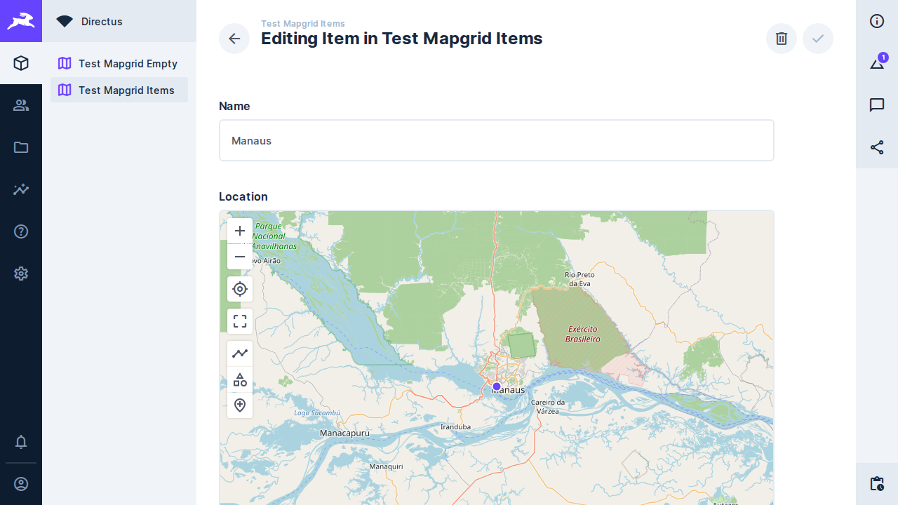
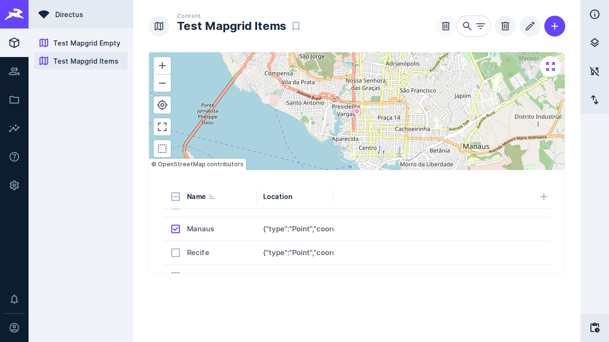

# Task 010 — O MapGrid compõe os layouts do Directus

Status: in-progress
Type: refactor
Assignee: sidartaveloso
Priority: 10

## Description

Hoje a extensão **reimplementa** o que o Directus já tem: a nossa grade imita o
layout tabular, e o nosso mapa imita o layout de mapa. A proposta é inverter —
compor os dois layouts que o Directus já registra, e a extensão passa a ser a
composição e a sincronia entre eles, não a reimplementação de nenhum.

O spike de 2026-09-18/19 mediu isso ponta a ponta no Directus 10.13.1, no branch
`spike/tabular-embed`. O registro completo está na task-008; o essencial:

- `layout.setup(props, { emit })` roda de dentro do **nosso** `setup()`, fora do
  `createLayoutWrapper`. Como o Directus entrega o retorno do nosso `setup()`
  tanto ao componente quanto ao painel de opções, o estado nasce num lugar só e
  chega aos dois — é o que resolve o painel, que é irmão do layout na árvore.
- Os dois layouts montam: `tabular: ok, 68 chaves · map: ok, 76 chaves`.
- As duas configurações deles aparecem na nossa barra lateral, ligadas ao mesmo
  estado que desenha, e abrir os painéis custa **zero** consulta a mais.
- `selection` e `layoutQuery` compartilhados sincronizam os dois: marcar na
  grade aparece no estado comum, e ordenar pelo cabeçalho deles refaz a busca
  dos dois.
- O clique na linha volta a ser nosso trocando o `onRowClick`.

## O que se ganha

O menu de cabeçalho inteiro (ordenar, alinhar, ocultar campo), largura de
coluna, o seletor de campos com busca e submenus de relação, os displays do
Directus nas células, e a configuração do mapa deles: mapa base, campo
geoespacial, template de exibição e agrupamento.

## O que se perde, e o que fica (decidido em 2026-09-19)

Adotar o layout de mapa deles aposenta o nosso `MapComponent` e o `MapToolbar`.
Duas coisas ficam, por decisão:

- **O clique linha→mapa fica.** É a razão de existir da extensão, e o spike já
  provou que dá, trocando o `onRowClick`.
- **Reenquadrar e zoom ao clicar ficam.** Significa reconstruir o `MapToolbar`
  sobre o mapa deles — injetar controle nosso dentro do componente deles, que é
  a parte mais cara desta task e não foi medida pelo spike.

Vão embora: o template do popup como é hoje, o enquadramento inicial único
(`performInitialFitBoundsOnce`) e os rótulos de agrupamento próprios.

Isso encosta em duas tasks abertas:

- **task-006** (navegar e reproduzir os registros no mapa) teria de ser
  reconstruída sobre o mapa deles, ou abandonada.
- **task-007** (honrar a configuração de mapa do Directus) talvez seja
  *atendida* por esta, já que o layout deles lê a configuração nativa.

## Pré-requisito — destravado em 2026-09-19

A decisão do dia foi fazer a task-009 primeiro, porque alinhamento, largura,
mapa base, campo geoespacial e agrupamento moram todos em `layoutOptions`, e o
diagnóstico dela dizia que `layoutOptions` não chegava ao preset.

A medição foi refeita e **não há defeito**: o painel grava e sobrevive ao
reload. A 009 fechou como erro de medição, e o bloqueio não existe. O teste de
regressão está em `tests/e2e/mapgrid-options-persistence.spec.ts`.

## Tasks

### Fase 1: fundação
- [ ] Extrair do spike o `embedLayout(id, options)`: chama o `setup()` do layout
      registrado, acrescenta os `onUpdate:<chave>`, devolve estado, componente e
      `slots.options`. Sem `any` — o spike usa, a implementação não pode
- [ ] Repassar `...toRefs(props)` junto do estado, como o `createLayoutWrapper`
      faz: o spike devolveu 68 chaves contra as 92 do wrapper, e a diferença são
      os props
- [ ] Teste de contrato: falha alta se `tableHeaders`, `onSortChange`, `items`,
      `geometryField` ou `slots.options` sumirem do que o Directus devolve

### Fase 2: a composição
- [x] `selection` e `layoutQuery` como estado único, os dois layouts escrevendo
- [ ] `onRowClick` nosso, para o clique na linha enquadrar em vez de navegar —
      **metade feito**: o clique deixou de navegar, mas o mapa não enquadra. Ver
      "O enquadramento não acontece na tela", abaixo
- [x] O caminho inverso: o `handleClick` do layout de mapa faz `router.push` para
      a tela do item quando não está em modo de seleção, então **clicar num ponto
      hoje sai do MapGrid**. Antes da composição, clicar no marcador selecionava a
      linha na grade, e o e2e que cobria isso ("should select the matching grid
      row when clicking a map marker") saiu na reescrita do `mapgrid-layout.spec.ts`.
      Trocar o `handleClick` como o `onRowClick` foi trocado, e devolver o e2e.
      A task-006 parte daqui para "clicar no ponto define o registro atual".
      Fechado em 2026-09-23 — ver "O clique no ponto" abaixo
- [x] Reverter as suposições de página inteira, que não estão na API e só o DOM
      revela: `.layout-tabular` traz `margin: 32px 0 132px`; o cabeçalho é
      `sticky` com deslocamento da altura do cabeçalho do app; `.layout-map`
      nasce `flex: 0 1 auto` e não estica
- [ ] Decidir o destino do `MapToolbar`, do zoom ao clicar e do popup — **é
      decisão reservada**, não do agente da rodada

### Fase 3: o que sai
- [ ] `TableComponent`, `MapComponent`, `MapToolbar` e os stubs que os servem
- [ ] `table-sort.ts`, `fieldsToFetch` e o que mais deixar de ter chamador
- [ ] A migração de preset da task-005 **fica**: `layoutQuery.fields` continua
      sendo o contrato
- [ ] Decidir o destino da migração do formato numerado (`coluna1..5`). Ela saiu
      na prática: o `normalizeLayoutOptions` segue em `src/contract/`, mas nada
      em `src/index.ts` o chama, e a grade embutida lê `fields` direto da
      consulta. Um preset da versão antiga não perde dados, mas as colunas dele
      deixam de ser honradas. Ou a migração volta, ou ela é abandonada de
      propósito — e aí saem juntos o `normalizeLayoutOptions` e o e2e que a
      cobria, hoje parado em `test.fixme` no `mapgrid-columns.spec.ts`

### Fase 4: verificação
- [ ] Os 155 unitários de hoje se apoiam nos componentes que saem; refazer o que
      continuar valendo e apagar o que virar teste de código morto
- [ ] Stories: o Storybook não alcança os layouts do Directus, porque lá o SDK é
      um mock nosso. Decidir o que resta de story
- [ ] e2e é onde esta task se prova, e o ambiente do docker é o único lugar
- [x] Reancorar os specs que ainda miram os componentes que saíram. Os seletores
      passaram a morar em `tests/e2e/helpers/mapgrid-page.ts`, um lugar só: os
      specs partem dos dois painéis da composição e, dentro deles, das classes
      dos layouts do Directus. A captura do README vinha com o mesmo defeito e
      foi junto
- [ ] Regressão de persistência herdada da task-009: gravar pelo painel uma
      opção de cada layout embutido (por exemplo `displayTemplate` do mapa e o
      espaçamento da grade) e conferir as duas no preset efetivo depois de um
      reload. Prova que `layoutOptions.map` e `layoutOptions.tabular` não se
      sobrescrevem, o que a regressão do `zoomOnClick` não alcança
- [ ] Regressão visual do espaço em branco, que é custo recorrente do desenho
- [ ] `pnpm screenshot` e evidência antes/depois — **o comando voltou a
      funcionar**, e a evidência do clique no marcador está acima. O `docs/tela.jpg`
      foi refeito. Não fecha porque falta a evidência das partes que ainda estão
      em aberto (o enquadramento, o destino do `MapToolbar`), e porque a imagem
      nova já mostra dois defeitos conhecidos: os rótulos do painel se
      sobrepõem, e sobra branco embaixo da grade
- [ ] README: a seção de colunas descreve a grade atual

## Evidência — o clique no marcador

| Antes | Depois |
| --- | --- |
|  |  |

O "antes" não é o MapGrid: é a tela de edição do item, onde o clique no marcador
deixava a pessoa. O "depois" continua no layout, com o marcador clicado em
destaque, a linha do Manaus marcada na grade e as ações em lote acesas no
cabeçalho — que é a ressalva registrada acima, visível na imagem.

As duas saem do mesmo roteiro (`tests/screenshot/evidencia-clique-no-ponto.spec.ts`),
mesmo Directus, mesma semente e mesma câmera; a única diferença é o
`dist/index.js`, construído de `b91e601` para o "antes". A captura parada do
layout não entra aqui porque não é evidência: rodada nos dois estados, ela sai
byte a byte idêntica — esta mudança não acrescenta elemento à tela, troca o que
o clique faz.

    EVIDENCE_TASK=010 EVIDENCE_MOMENT=antes|depois \
      .sandcastle/no-espelho.sh pnpm screenshot

## O enquadramento não acontece na tela — medido em 2026-09-24

Achado ao escrever o e2e do clique no ponto, e ele derruba um item que o
documento dava por fechado.

O `enquadrarItem` escreve `cameraOptions` no estado do mapa embutido. Essa
escrita **chega**: `layoutOptions.map.cameraOptions` sai no preset com o
`center` e o `zoom` certos, e dá para conferir pela API. O mapa desenhado, no
entanto, **não se mexe** — a captura de falha mostra o mundo inteiro depois de
um clique na linha que pediu zoom 14 em Manaus.

O layout de mapa do Directus lê `cameraOptions` **ao montar** e ignora a troca
depois disso. Duas medições sustentam a frase:

- uma câmera semeada no preset antes do carregamento é honrada — é justamente
  por isso que o e2e consegue achar um marcador;
- as duas formas de `center` foram tentadas, o par cru e o `{ lng, lat }` que
  eles mesmos gravam a cada `moveend`. Nenhuma move o mapa vivo.

Ou seja: o zoom ao clicar só tem efeito na **visita seguinte**, quando o preset
vira a câmera inicial.

Mover a câmera de verdade exige alcançar a instância do MapLibre deles, que é a
mesma decisão reservada do `MapToolbar` e do zoom ao clicar — por isso esta
rodada parou aqui e não escolheu um caminho. O e2e que prova o enquadramento
está escrito, e parado em `test.fixme` no `mapgrid-layout.spec.ts` com o motivo:
ele passa a valer no dia em que a decisão sair.

## O clique no ponto — fechado em 2026-09-23

O `handleClick` do layout de mapa é trocado no `propsDoMapa`, pelo mesmo caminho
que o `onRowClick` já usava: quem monta os props do componente embutido é o
nosso template, então basta sobrescrever a chave. No lugar do `router.push`
entra a outra metade do que eles mesmos fazem — marcar o item na `selection`,
que é estado compartilhado pelos dois embutidos. A linha acende na grade porque
a grade lê a mesma `selection`, não porque o template toque no DOM dela.

Marcador e caixa de marcação passam a ser a mesma linguagem: clicar num ponto já
marcado o desmarca, e clicar noutro acrescenta.

**Ressalva herdada, e é da task-006 decidir o que fazer com ela.** A `selection`
também arma as ações em lote, então marcar pelo mapa habilita o apagar. A
task-006 já registra que "registro atual" não deveria usar `selection`; enquanto
essa decisão não sai, usar a `selection` é o único destaque que o `v-table`
oferece sem alcançar o DOM dele por fora.

Provas:

- unitária, em `MapgridLayout.test.ts`: o `handleClick` que chega ao componente
  do mapa é o nosso, o deles não é chamado, e acrescentar/remover/ignorar o
  clique sem item estão fixados;
- e2e, em `mapgrid-layout.spec.ts` ("clicar num ponto marca a linha dele na
  grade, e não sai do MapGrid"). Achar um marcador num canvas de MapLibre exige
  a câmera, e a instância do mapa é deles; o spec dispensa a projeção pondo o
  marcador onde já se sabe — o clique na linha centraliza o item, e o alvo é
  Manaus, a cidade mais isolada da semente, para o clique no centro não cair num
  agrupamento.

## Notes

O `dist` da extensão resolve `@directus/extensions-sdk` como externo, então vale
o SDK do Directus em execução, não o que compilamos. O spike confirmou
`useLayout` e `useExtensions` no 10.13.1, que é o que o e2e roda.

Sobra uma consulta sem atribuição: um `GET /items/<colecao>/<id>` de item único
aparece no carregamento, e não achei a origem.

Nesta máquina `pnpm test:e2e` não funciona — o host não alcança portas
publicadas pelo docker. O caminho é `--profile runner`, de dentro da rede. E o
Directus carrega a extensão no boot: todo rebuild exige `docker restart`.
