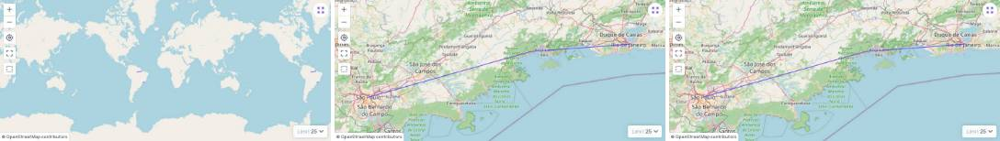
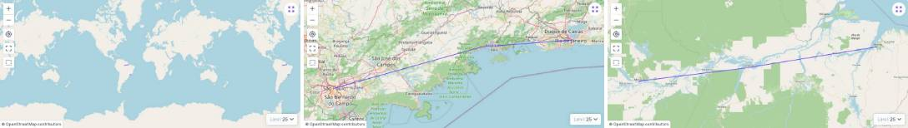

# 🧩 Task 012 — A entrega ao mapa depois da busca funciona com o Vue do Directus

- Status: done
- Type: fix
- Assignee: sidartaveloso
- Priority: 650

## Description

Com geometria nativa, depois de o `CentralizadorDoMapaDirectus` mover o mapa uma
vez, o pedido seguinte que depende de buscar a geometria na API
(`centralizarItem` de um item fora da tela, `enquadrarTudo`) grava o
`geojsonBounds` novo no estado do layout embutido, mas o layout de mapa do
Directus continua recebendo o valor anterior: o `MapgridLayout` não volta a
renderizar.

> **Corrigido e fechado em 2026-09-24.** As duas frases abaixo, que estavam
> aqui, estão **erradas**, e ficam registradas porque o erro é o achado: "só
> acontece com o Vue 3.4.27" e "com o 3.5 do projeto não acontece". Não é o Vue
> do app — o defeito reproduz igual nas duas versões. A causa é o
> `showingCount` do layout embutido, e está na seção "A causa", abaixo.

O defeito estava reproduzido em
`src/components/templates/mapgrid-layout/MapgridLayout.vue-do-directus.test.ts`,
em `it.fails`. Aquele `it.fails` media outra coisa — ver "O que o reprodutor
media", abaixo.

Diagnóstico anterior, hoje superado: task-007, seção "Geometria nativa".

## Tasks
<!-- [x] feito · [ ] em aberto · [ ] ... — adiado: <razão> para o que se decidiu não fazer -->
- [x] Achar o mecanismo no Vue 3.4 que impede o novo render, usando o teste
      reprodutor, e registrar aqui em uma frase. **Não existe mecanismo no Vue
      3.4**: o reprodutor era artefato do arranjo de teste — ver "O que o
      reprodutor media", abaixo
- [x] Corrigir no MapGrid, sem depender da versão do Vue: o `it.fails` vira `it`
      e passa nas duas configurações (`pnpm test`). O `it.fails` passou só com o
      arranjo consertado, e a correção de verdade veio depois — ver "A causa"
- [x] Tirar de `test.fixme` os dois e2e de `tests/e2e/mapgrid-trajetos.spec.ts`
      e ver `pnpm test:e2e` verde. **21 passed (2,5 min)**, os três de
      `mapgrid-trajetos.spec.ts` inclusive
- [x] Na task-007, trocar o item adiado pela referência a esta task
- [x] Evidência do movimento: tira de quadros antes/depois em `TASKS/assets`

## A causa — medida em 2026-09-24

O `showingCount` dos layouts embutidos é um `computed` cujo getter chama
`useI18n()`. Sem instância corrente o vue-i18n levanta `MUST_BE_CALL_SETUP_TOP`
— e é exatamente o `SyntaxError` que a task-007 anotou no console "a cada busca
filtrada" e deu por não relacionado.

Quem avalia esse getter fora do render é o **agendador do Vue**: antes de
repintar ele pergunta ao efeito se está sujo, e a resposta percorre os
`computed` de que ele depende reavaliando cada um — sem render, sem instância.
Bastava o `showingCount` ter sido lido uma vez com sucesso (no primeiro render,
onde há instância) para virar dependência do nosso `propsDoMapa` e entrar nessa
varredura. A explosão matava a pergunta no meio — no 3.4 sem nem desfazer o
`pauseTracking` que ela mesma põe — e daí em diante a composição não repintava
mais. O `geojsonBounds` novo ficava no estado e nunca chegava ao mapa.

A correção está em `src/services/embedded-layout/leitor-de-estado.ts`: a chave
sai da leitura **pelo nome**. Um `try` em volta não alcança, porque quem lê o
getter nessa hora não somos nós — o `try` ficou assim mesmo, pelo que ele cobre
(a chave que explode já na primeira leitura nunca chega a ser registrada como
dependência, e fica contida em uma chave só).

Nada se perde: `showingCount` é o "1-25 de 132" do cabeçalho do Directus, e o
cabeçalho do MapGrid monta o dele de `itemCount` e `totalCount`, em
`src/index.ts`.

Como se prova, nas duas versões do Vue:
`MapgridLayout.test.ts` e `MapgridLayout.vue-do-directus.test.ts`, em "um getter
do estado embutido que explode fora do render". Com a chave de volta na leitura,
os dois reprovam — 3.5.22 e 3.4.27 igual. **Não era o Vue do app.**

## Evidência

Mundo inteiro → clique em "Rio → São Paulo" → clique em "Manaus → Belém". No
**antes**, o segundo e o terceiro quadro são a mesma imagem: o mapa congelou
depois do primeiro voo. No **depois**, o terceiro quadro é a Amazônia — o
trajeto fora da tela, cuja geometria precisa ser buscada na API.

Gerada por `tests/screenshot/evidencia-trajetos.spec.ts`; o "antes" saiu do
`dist` construído de 37d0f2e, mesmo ambiente e mesma coleção.

## O que o reprodutor media — medido em 2026-09-24

O `vitest.vue-do-directus.config.ts` apontava `vue` para o `vue-do-directus`
(3.4.27), e a guarda `expect(version).toBe('3.4.27')` passava — mas só para o
arquivo de teste. O `@vue/test-utils` tem condição `node` no `exports`, e o
vitest roda em node: o `mount` vinha do pacote CommonJS, cujo `require('vue')`
o alias não alcança. Ele montava com o **Vue 3.5.22 do projeto**.

Com duas cópias do Vue, o estado do teste é de uma reatividade e o efeito de
render é de outra: ler um `ref` de 3.4 dentro de um render de 3.5 não registra
dependência nenhuma. **Nenhum componente montado por aquele arquivo re-renderizava
jamais** — provado com um `ref(0)` criado dentro do próprio `setup()`, que
também não repintava. O `it.fails` reprovava por isso, não por defeito no
MapGrid nem por versão do Vue.

Com o alias apontando o `@vue/test-utils` para o `dist/vue-test-utils.esm-bundler.mjs`,
as duas metades passam a usar o 3.4.27 — e o teste de "entregar ao mapa depois
da busca" **passa sem um caractere de mudança no MapGrid**. A guarda nova
(`monta com esse mesmo Vue: uma reatividade só, não duas`) impede o arranjo de
voltar a mentir.

Duas consequências para quem retomar:

- a conclusão da task-007 ("é o Vue do app", "passa no 3.5 e falha no 3.4") está
  **errada**, e foi errada pelo mesmo motivo;
- o defeito do e2e era real, e tinha outra causa — a da seção "A causa".

## Notes
