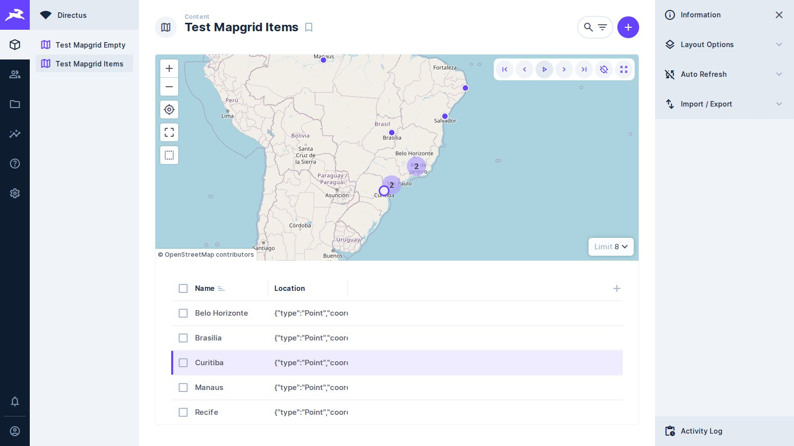
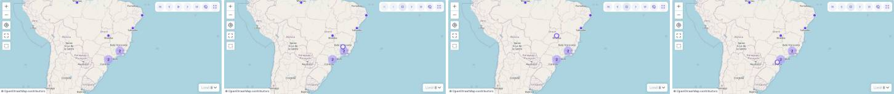

# 🧩 Task 015 — O registro atual aparece no mapa mesmo agrupado, com atalhos de teclado e a virada de pagina medida

- Status: in-review
- Type: feat
- Assignee: sidartaveloso
- Priority: 750

## Description
O que sobrou da task-006, que entregou passo, reprodução, virada de página e
acompanhamento de câmera.

**O registro atual aparece no mapa mesmo dentro de um cluster.** Com o
agrupamento ligado, o ponto do registro atual some no cluster, e a reprodução
fica invisível no mapa. A direção (Sidarta): a reprodução continua andando na
grade, e o mapa plota à parte o ponto do registro atual. O `clusterData` segue
como está no preset: não se desliga o agrupamento, nem de forma temporária.
Restrições que já valem:
- o registro atual **não** passa pelo `selection`, que arma as ações em lote
  (decisão da task-006);
- a instância do MapLibre do layout do Directus não é exposta. O contorno fica
  atrás de um método próprio, documentado como limitação e provisório até haver
  suporte nativo, e cabe no contrato de mapa da task-011.

**Atalhos de teclado.** Primeiro, anterior, próximo, último e play/stop, ativos
só com o layout em foco. Conferir contra a lista de atalhos do Directus antes de
escolher as teclas.

**Virada de página durante a reprodução, medida.** O mapa e o cluster têm só os
registros da página corrente, não os da consulta inteira. O custo a medir é a
busca a cada virada: com 25 por página, um trajeto de mil pontos são quarenta
requisições, possivelmente o dobro com a consulta compartilhada. O seed do e2e
tem oito registros, que provam o comportamento mas não medem nada.

## Tasks
<!-- [x] feito · [ ] em aberto · [ ] ... — adiado: <razão> para o que se decidiu não fazer -->
- [x] Teste vermelho: com agrupamento ligado, o registro atual aparece no mapa
      como ponto próprio, fora do cluster, e acompanha cada passo. Feito nos
      unitários do `DirectusCurrentPoint` e do `MapgridLayout`
- [x] O ponto do registro atual, atrás de um método próprio documentado como
      limitação: `DirectusCurrentPoint.screenPointOf()`,
      `src/services/current-point/`. O `clusterData` do preset não muda
- [x] Atalhos de teclado com o layout em foco, sem colidir com os do Directus,
      e textos de ajuda em en-US e pt-BR. `KeyboardNavigation`, com Home/End,
      ←/→ e Espaço; a lista do Directus foi conferida na fonte da 10.13.1 (ver
      "A lista de atalhos do Directus")
- [x] Contar as requisições de uma reprodução sobre um trajeto sintético de mil
      pontos no ambiente do e2e, com a consulta compartilhada. Feito em
      `tests/e2e/mapgrid-page-turn-cost.spec.ts` — ver "A medição"
- [x] Registrar a medição como linha de base da task-016, que explora antecipar
      a busca da próxima página
- [x] Evidência de tela: a reprodução visível no mapa com o agrupamento ligado.
      `tests/screenshot/evidence-clustering.spec.ts` — ver "A evidência"

## A evidência



O agrupamento está ligado — os dois grupos de "2" sobre Rio e São Paulo são a
prova. O registro atual é Curitiba: o ponto vazado com anel, desenhado à parte
sobre o agrupamento, e a linha marcada na grade com a caixa de seleção
desmarcada — o registro atual não passa pelo `selection`.



Quatro quadros do painel do mapa durante a reprodução. O primeiro não tem
registro atual: só os agrupamentos, que é o estado em que o ponto sumia. Nos
três seguintes o anel anda — Belo Horizonte, Brasília, Curitiba — enquanto os
agrupamentos ficam onde estão, porque `cameraTracking` está em `off` de
propósito: o que se move no quadro é a marca, e não o mapa.

A câmera é semeada larga (zoom 3 sobre o sudeste). Enquadrando a coleção, as
oito cidades se espalham pelo painel e nenhum agrupamento se forma — o próprio
assunto da evidência ficaria fora da tela.

Gerada por `tests/screenshot/evidence-clustering.spec.ts`, que também reprova se
dois quadros seguidos saírem idênticos. Não há "antes": o primeiro quadro da
tira é o estado anterior — o agrupamento sozinho, sem o registro atual.

Para capturar só esta evidência, e não a de todas as tasks de uma vez:

```
EVIDENCE_TASK=015 EVIDENCE_MOMENT=depois \
  RUNNER_ARGS=tests/screenshot/evidence-clustering.spec.ts \
  .sandcastle/on-mirror.sh pnpm screenshot
```

## A medição

Feita em 2026-09-25, no ambiente do e2e (Directus 10.13.1 em docker, banco na
mesma rede, um worker). O cenário é reproduzível e está no repositório:
`tests/helpers/track-collection.ts` semeia `test_mapgrid_track`, mil pontos de
um trajeto sintético com um campo `sequence` para a ordem, e
`tests/e2e/mapgrid-page-turn-cost.spec.ts` faz a conta. A geometria é `json`, e
não a nativa: com a nativa o mapa deles acrescenta o filtro pela área visível e
a conta passa a ser outra — isso não foi medido.

```
route: 1000 points, 25 per page, 40 pages
steps inside a page: 0 fetches for 3 steps
page turn: 2, 2, 2 record fetches, 0, 0, 0 count queries — 92, 107, 86 ms
a whole playback: 2 × 39 turns = 78 fetches
```

O que ela diz, e que a task supunha sem saber:

- **Passo dentro da página não busca nada.** A lista já está na mão; andar nela
  é memória.
- **A virada custa duas buscas, e não uma.** É o dobro que a task-006 levantou,
  e a causa é a consulta compartilhada ser compartilhada só nos *parâmetros*:
  cada layout embutido tem o seu `useItems`, e os dois refazem a busca quando a
  `page` muda. Duas buscas por virada, sempre — as três medições deram o mesmo
  número.
- **A contagem não se repete.** Zero `aggregate` por virada: o total de páginas
  é buscado uma vez, no carregamento.
- **Uma reprodução inteira do trajeto são 78 buscas**, e não as quarenta que a
  task estimava — 2 × 39 viradas.
- **Cada virada custa de 86 a 107 ms** entre o clique e o registro novo virar o
  atual, nesta máquina e com o banco ao lado. É o tempo que a task-016 tem a
  ganhar, e numa instalação com rede no meio ele é maior.

O spec deixa a linha de base como guarda: se a virada passar a custar mais de
duas buscas, ele reprova.

## A lista de atalhos do Directus

Conferida na fonte da 10.13.1, que é a versão que o e2e roda
(`grep -r "useShortcut(" app/src`):

| Atalho | Onde |
| --- | --- |
| `meta+s` | Salvar, em toda tela de item — conteúdo, arquivos, usuários, papéis, traduções, presets, flows, painéis, modelo de dados, aparência, projeto |
| `meta+shift+s` | Salvar e criar outro, em item de conteúdo, usuários e traduções |
| `meta+a` | **Selecionar tudo, no layout tabular** — o que o MapGrid embute |
| `meta+enter` | Publicar comentário |
| `meta+b`, `meta+i`, `meta+k`, `meta+alt+…` | Editor markdown |
| `escape` | Fechar o `v-dialog` |

Todos levam `meta`, com a única exceção do `escape`. Por isso os atalhos daqui
são teclas puras — Home, End, ←, → e Espaço —, e qualquer modificador segurado
devolve o evento para eles: é o `meta+a` da grade embutida que continua
funcionando. Digitar num campo (`input`, `textarea`, `select`,
`contenteditable`) também devolve.

O escopo repete a regra do `useShortcut` deles: atende quando o foco está
dentro do layout **ou** quando não está em lugar nenhum (`document.body`), que
é como a página começa.

## Notes
Veio dos critérios não feitos da task-006 (Fases 3, 4 e 5).
